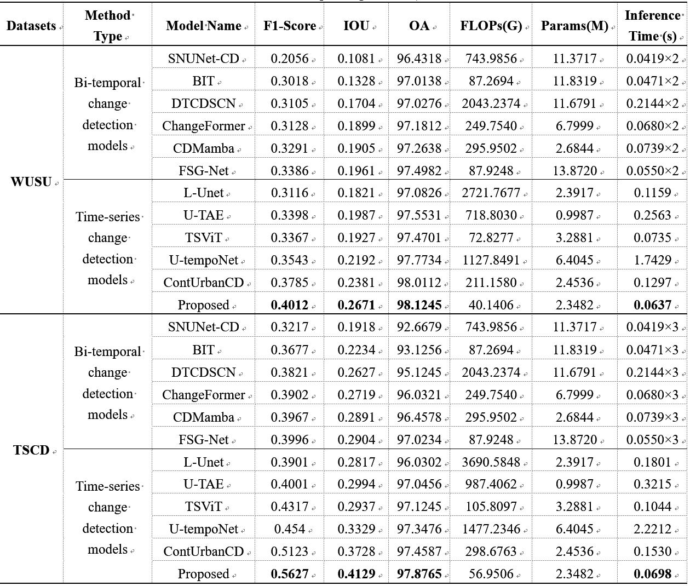
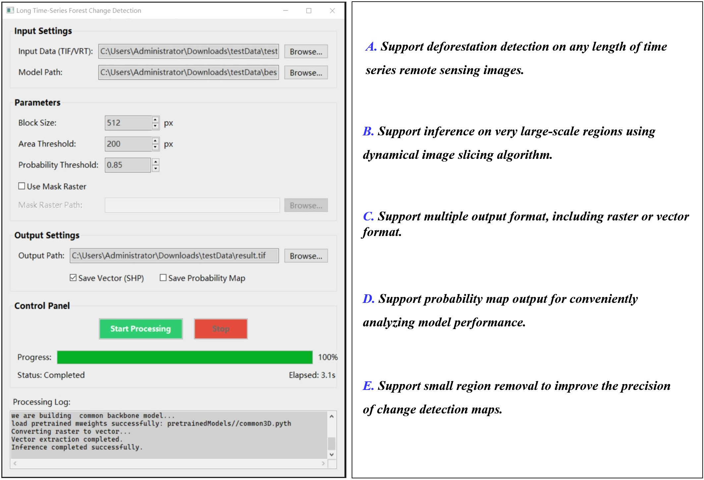
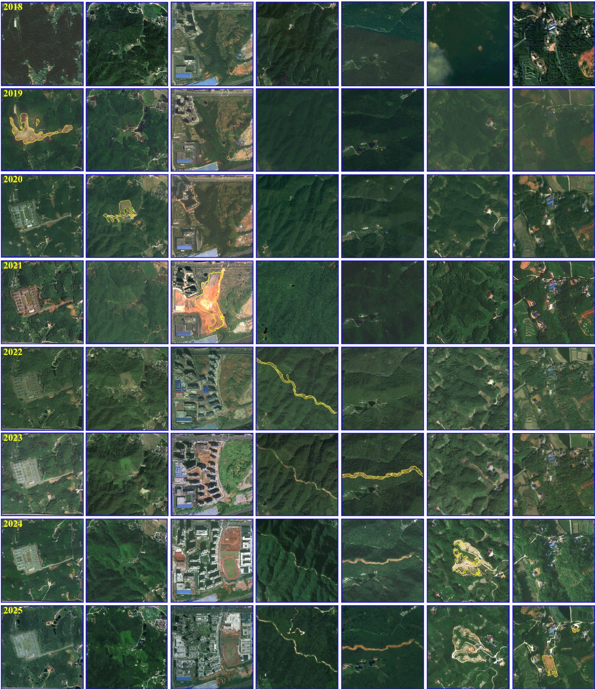
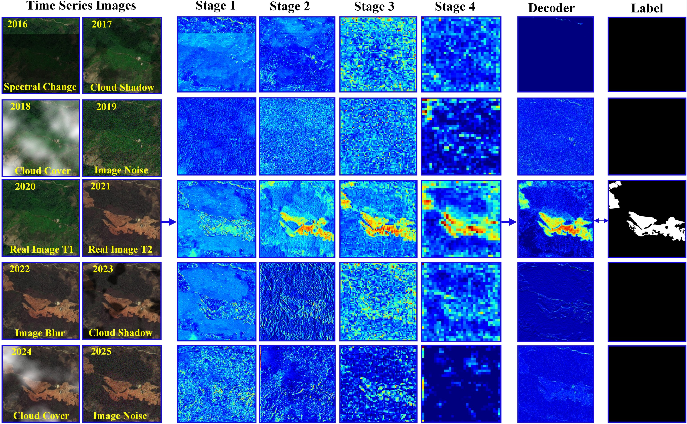

# A lightweight video percetion for time series remote sensing change detection
This is the official code library of TSVediochange.

### Develop environment
```python
python 3.10
gdal == 3.4.3
opencv-python = 4.11.0.86
torch == 2.6.0
tochvision == 0.21.0
rasterio == 1.4.3
geopandas == 1.0.1
scikit-image == 0.25.2
numpy == 1.26.4
onnxruntime-gpu == 1.17.0
```

### 1. Run model parameter test
1. Please run the following code:
```python
python Parameter.py
```

2. The parameters and inference times of various models can be seen below:



### 2. Run time series change detection software test
1. We used the pyinstaler to build the time series change detection software; You can download it from:
Baidu cloud disk: https://pan.baidu.com/s/1eLGD6imorM5xOSkC7CeXVQ passhey: 1234

1. The GUI of TSVedioChange can be seen below:
   


3. This tool only support Windows platform, not support Liunx, or MacOS in current time.

### 3. Experiments results
1. In our research, we selected Changsha City as the experimental region; The time series change detection results can be seen:



### 4. Semantic feature visualization
1. The semantic features of TSVedioChange can be seen below:



### Reference
If you think our work is useful for your research, please cite it as：
```python
Zhipan Wang, et al. A Lightweight Video Perception Paradigm for Large-scale Time Series Deforestation detection With Very-High-Resolution Remote Sensing Imagery. 2026 (Under Review)
```